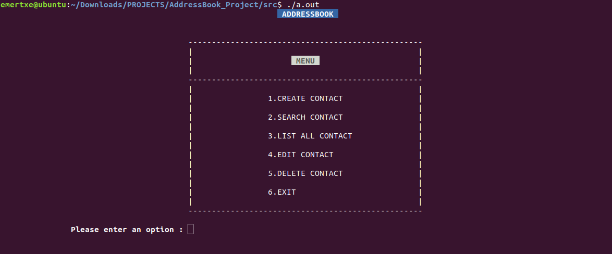
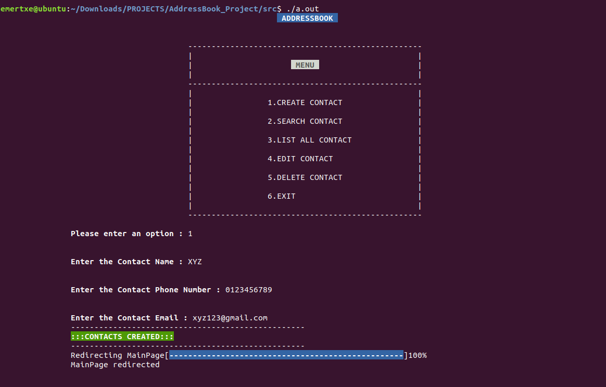
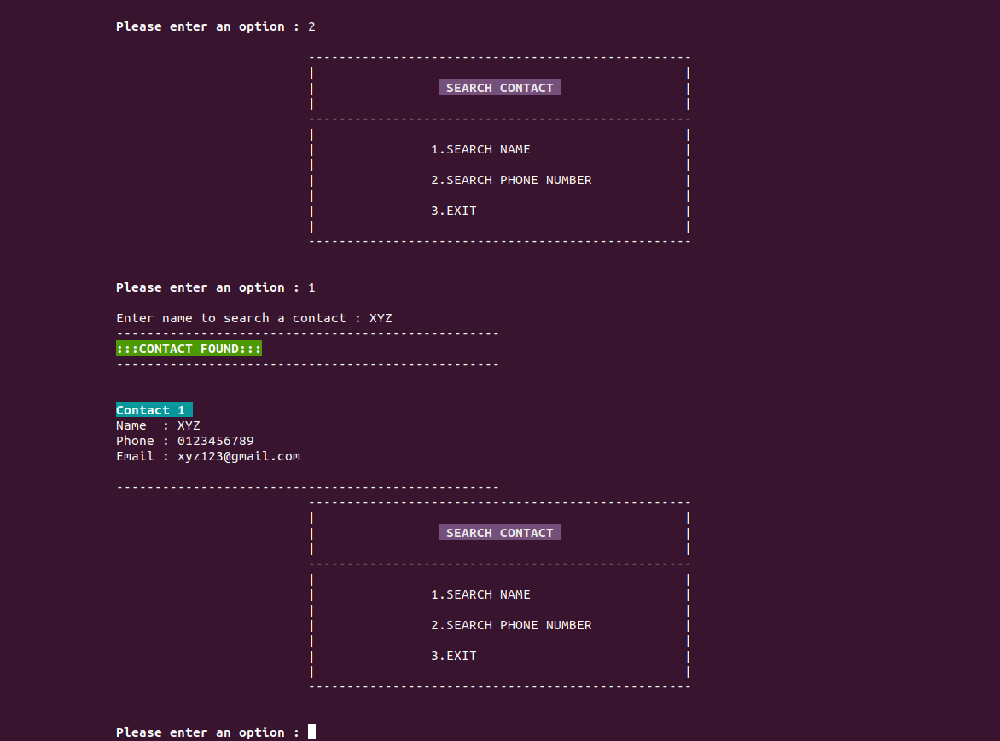
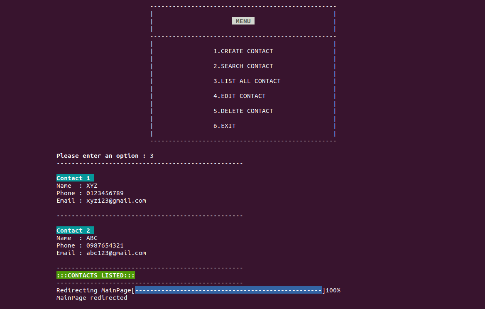
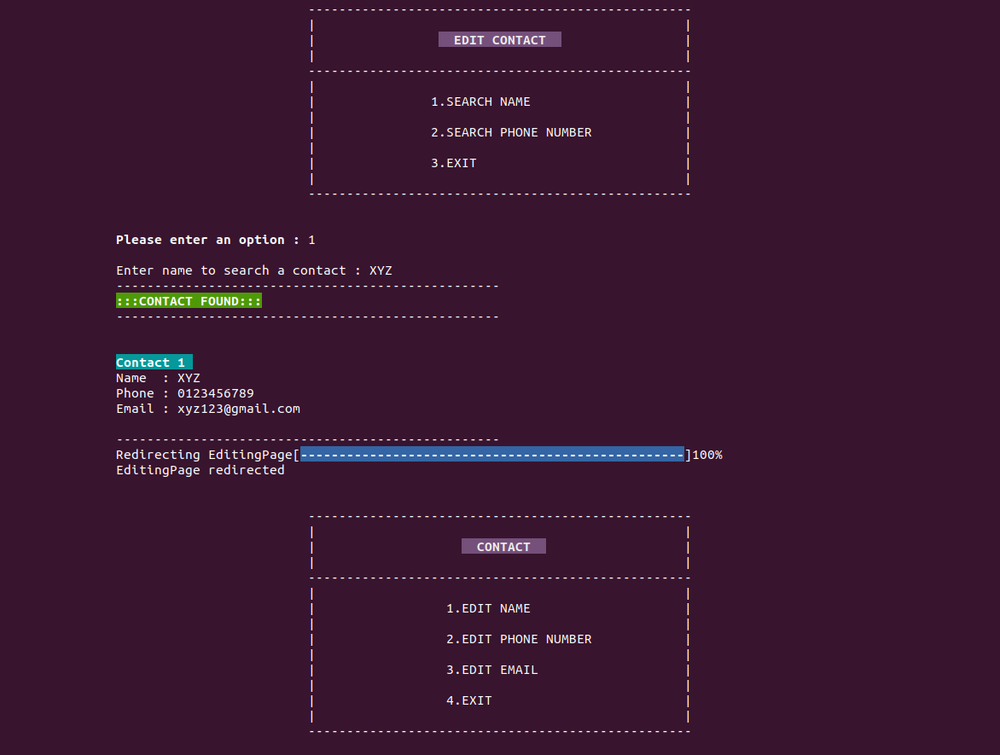
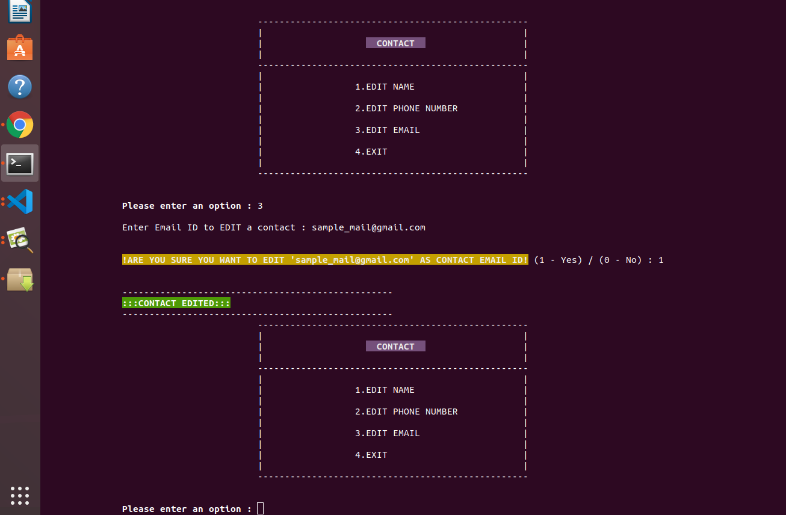
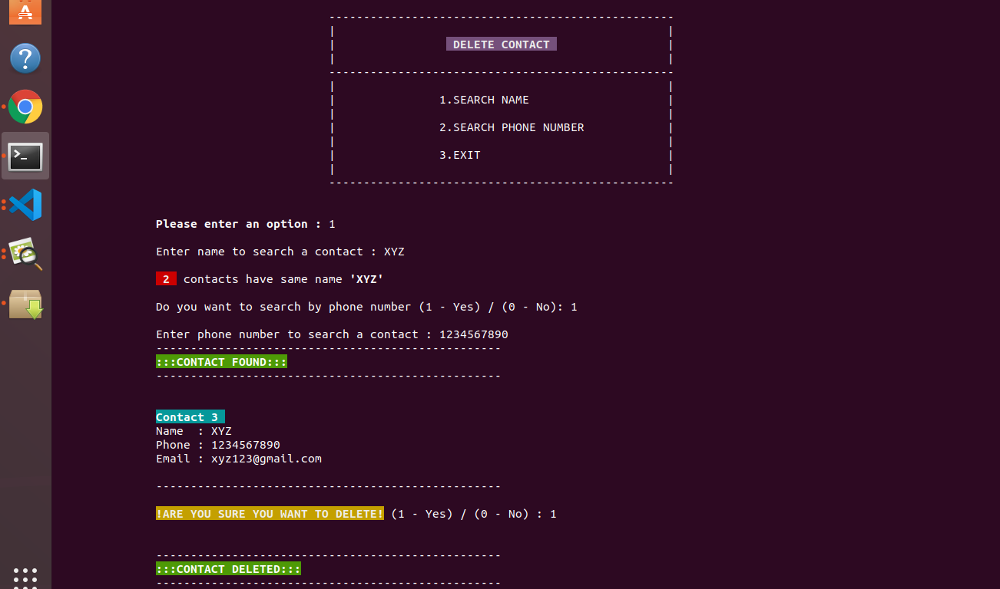

## AddressBook Project

## Overview

    The Address Book project is a command-line application developed on a Linux machine. 
    It allows users to manage contacts efficiently, including adding, viewing, editing, and deleting contact information. 
    This project demonstrates proficiency in C programming, file handling, and data management.

## Features

    Add Contacts: Store details such as name, phone number, email address, and address.

    Display Contacts: Display a list of all stored contacts.

    Search Contacts: Find contacts by name or phone number.

    Edit Contacts: Update the details of an existing contact.

    Delete Contacts: Remove a contact from the address book.

    File Persistence: All data is stored in a file, ensuring persistence across sessions.

## Technologies Used

    Programming Language: C

    Platform: Linux Machine(Ubuntu)

    File Handling: Used for storing and retrieving contact data

## Installation

    Clone the repository:

        git clone <repository-url>

    Navigate to the project directory:

        cd AddressBook_Project

    Compile the program on windows machine:

        gcc main.c contact.h contact.c -o output.exe

    Run the program on windows machine:

        output.exe
------------------------------------------------------
    Compile the program on linux machine:

        gcc *.c

    Run the program on linux machine:

        ./a.out

## Usage

    Upon running the program, you will be presented with a menu of options:

                Add Contact

                Display Contacts

                Search Contacts

                Edit Contact

                Delete Contact

                Exit

        Select an option by entering the corresponding number.

        Follow the on-screen instructions to perform the desired operation.

## Screenshots

## File Structure

    main.c: Main program file containing all functionality.

    contacts.txt: Data file where contact details are stored.

    assests/screenshots/: Folder containing screenshots of the application.

## How It Works

    Adding Contacts:

        The user enters contact details.

        The program appends the details to a file (AddressBook.csv).

    Displaying Contacts:

        Reads data from the file and displays it in a formatted list.

    Searching Contacts:

        Searches for a contact by name or phone number and displays matching results.

    Editing Contacts:

        Searches for a contact, allows the user to modify its details, and updates the file.

    Deleting Contacts:

        Removes the selected contact's details from the file.

## Learning Outcomes

    Mastery of file handling in C.

    Enhanced problem-solving skills in data management.

    Experience with creating user-friendly command-line interfaces.

    Debugging and testing in a Linux environment.

## Future Enhancements

    Add support for sorting contacts alphabetically or by phone number.

    Implement encryption for secure data storage.

    Create a graphical user interface (GUI) for improved usability.

## License

    This project is not licensed.

## Feel free to suggest any additional features or improvements!